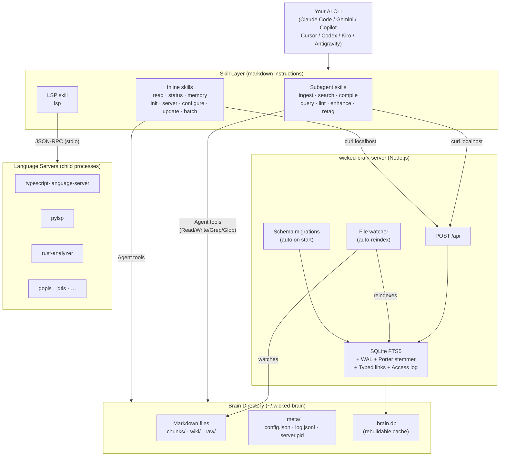
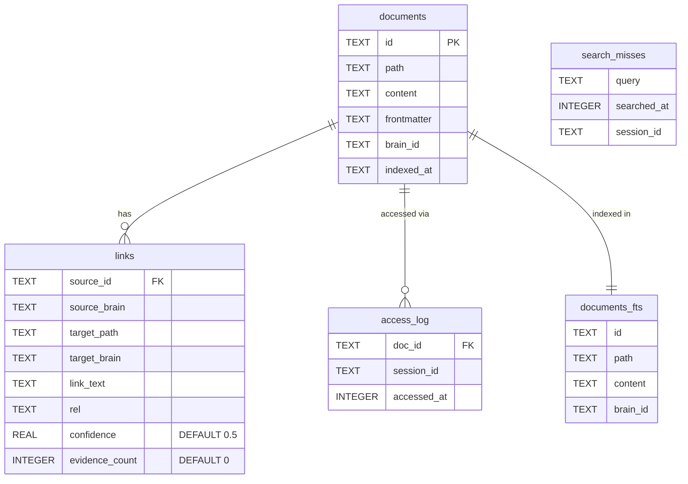
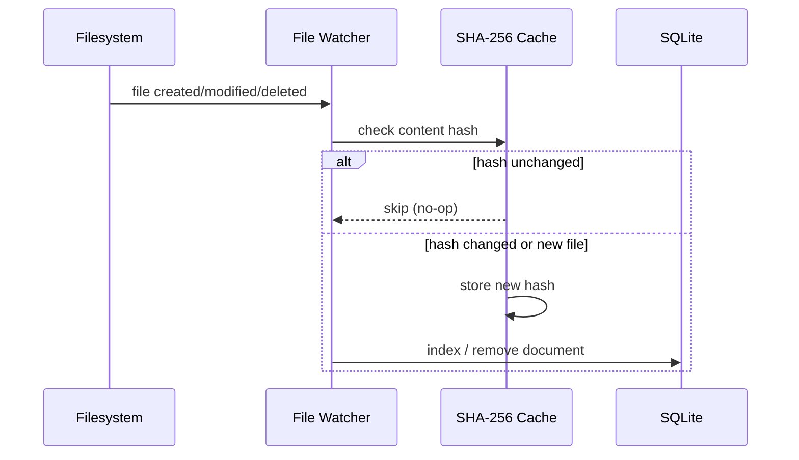
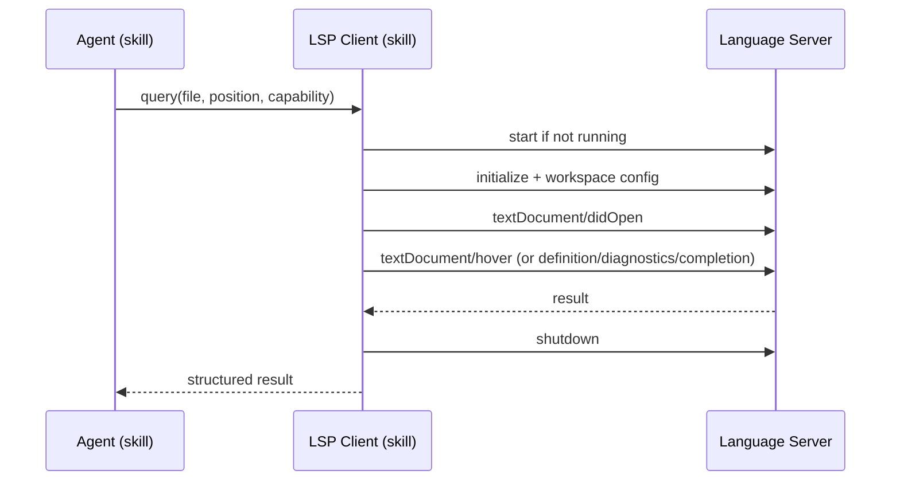
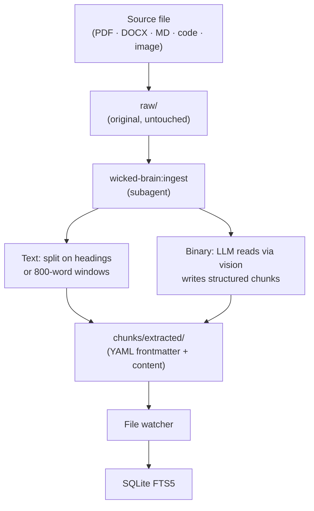
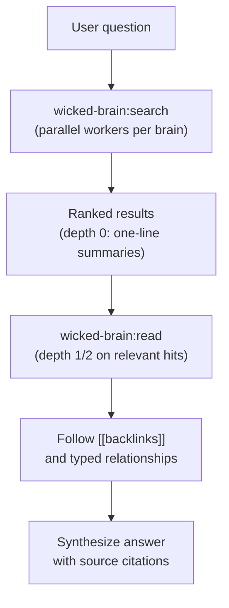
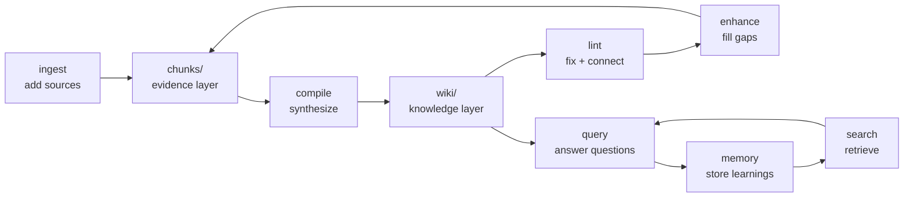
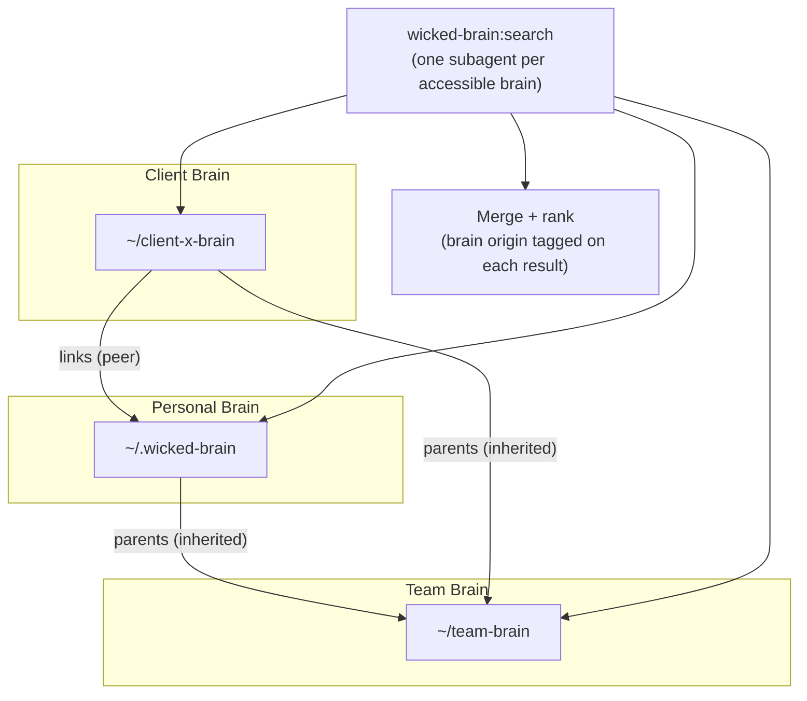

# Architecture

> **Why it works this way:** See [HOW-IT-WORKS.md](HOW-IT-WORKS.md) for the reasoning behind FTS over vectors, progressive loading, the agent-as-parser pattern, and the compounding brain model.

wicked-brain has three runtime components: a **skill layer** (markdown instructions in your AI CLI), a **search server** (SQLite FTS5 over HTTP), and an optional **LSP client** (code intelligence via language servers). Everything else is markdown on your filesystem.

---

## System Overview



---

## Component: Skill Layer

Skills are SKILL.md files installed into your CLI's skills directory by the installer. The agent reads the skill when triggered and follows its instructions using its own native tools.

```mermaid
graph LR
    subgraph Inline["Inline (runs in conversation)"]
        read["wicked-brain:read<br/>progressive depth 0/1/2"]
        status["wicked-brain:status<br/>health + convergence debt + hotspots"]
        memory["wicked-brain:memory<br/>working/episodic/semantic tiers"]
        confirm["wicked-brain:confirm<br/>strengthen/weaken link confidence"]
        synonyms["wicked-brain:synonyms<br/>manage search synonym map"]
        init["wicked-brain:init<br/>setup + fires onboard agent"]
        server["wicked-brain:server<br/>start/check/stop"]
        configure["wicked-brain:configure<br/>writes CLAUDE.md / GEMINI.md"]
        update["wicked-brain:update<br/>npm check + reinstall"]
        batch["wicked-brain:batch<br/>generates bulk scripts"]
        lsp["wicked-brain:lsp<br/>LSP queries via JSON-RPC"]
    end

    subgraph Subagent["Subagent (isolated worker)"]
        ingest["wicked-brain:ingest<br/>chunk + index source files"]
        search["wicked-brain:search<br/>synonym expansion + parallel search"]
        compile["wicked-brain:compile<br/>persona-driven synthesis + consensus"]
        query["wicked-brain:query<br/>search → read → answer"]
        lint["wicked-brain:lint<br/>links · orphans · confidence · synonyms"]
        enhance["wicked-brain:enhance<br/>fill gaps with inferred content"]
        retag["wicked-brain:retag<br/>backfill synonym tags"]
    end
```



**Installer:** `install.mjs` detects installed CLIs by checking for their config directories and copies all skills into `<cli-dir>/skills/`. Platform-specific agents go to `<cli-dir>/agents/`. Supports `--cli=<name>` to filter and `--path=<dir>` for non-standard locations.

---

## Component: Search Server

A Node.js HTTP server (~300 lines) with a single `POST /api` endpoint. One runtime dependency: `better-sqlite3`.

### API Actions

| Action | Parameters | Returns |
|---|---|---|
| `health` | — | `{ status, uptime, docCount }` |
| `search` | `query, brain_id, limit, since, session_id` | Ranked results with snippets |
| `federated_search` | `query, brain_paths, session_id` | Merged results across brains |
| `index` | `id, path, content, frontmatter, brain_id` | `{ ok }` |
| `remove` | `id` | `{ ok }` |
| `reindex` | `docs[]` | `{ ok, count }` |
| `backlinks` | `path, brain_id` | Docs that `[[link]]` to this path |
| `forward_links` | `id` | Links this doc references |
| `stats` | `brain_id` | Doc counts, index size, last activity |
| `candidates` | `brain_id, mode` | Docs for promotion (`high-access`) or archival (`zero-access`) |
| `recentMemories` | `brain_id, days` | Memory-tier docs from last N days |
| `contradictions` | — | All `contradicts` typed links |
| `confirm_link` | `source_id, target_path, verdict` | Adjust link confidence (+0.1 confirm / -0.2 contradict) |
| `link_health` | — | Broken links, low-confidence links, avg confidence |
| `tag_frequency` | — | Tag counts from document frontmatter |
| `search_misses` | `limit, since` | Queries that returned zero results |
| `schemaVersion` | — | Current schema version integer |

### SQLite Schema



**Notes:**
- `documents_fts` uses `fts5` with `tokenize='porter unicode61'` for stemmed full-text search
- `links.rel` is `null` for standard `[[wikilinks]]`, non-null for typed relationships (`contradicts`, `supersedes`, `supports`, `caused-by`, `extends`, `depends-on`, `questions`)
- `links.confidence` starts at 0.5, increases with `confirm_link` confirmations (+0.1), decreases with contradictions (-0.2), clamped to [0.0, 1.0]
- `access_log` drives session diversity ranking — documents accessed this session are deprioritized in favor of unseen related content
- `search_misses` tracks queries that returned zero results, enabling synonym auto-suggestion
- Schema is versioned (currently v2); migrations run automatically on server start — existing databases upgrade without manual intervention

### File Watcher



Uses `fs.watch({ recursive: true })` on macOS and Windows. Falls back to 3-second polling on Linux where recursive watch is unsupported. Only watches `chunks/` and `wiki/` — `raw/` is not indexed directly.

---

## Component: LSP Client

`wicked-brain:lsp` provides code intelligence by connecting to language servers via JSON-RPC over stdio. No additional npm dependencies — the JSON-RPC layer is hand-rolled.



Language servers are auto-installed on first use if not found in PATH. Supported out of the box: `typescript-language-server`, `pylsp`, `rust-analyzer`, `gopls`, `jdtls`.

---

## Brain Directory Structure

```
~/.wicked-brain/
├── brain.json                    # Identity, parent links, peer links
├── raw/                          # Source files (originals or symlinks)
├── chunks/
│   ├── extracted/                # Source-faithful extractions (YAML frontmatter + content)
│   │   └── <source-name>/        # One directory per ingested source
│   ├── inferred/                 # LLM-generated content (clearly separated from extracted)
│   └── memory/                   # Experiential learnings (working / episodic / semantic)
├── wiki/
│   ├── concepts/                 # Synthesized articles about specific concepts
│   ├── topics/                   # Broader topic articles
│   └── projects/                 # Per-project onboarding articles (from onboard agent)
├── _meta/
│   ├── config.json               # Server port, brain path
│   ├── log.jsonl                 # Append-only event log
│   └── server.pid                # Running server PID (absent when stopped)
└── .brain.db                     # SQLite FTS5 index (rebuildable from markdown)
```

**Two content layers:**
- `chunks/` — evidence layer, traceable to specific source files
- `wiki/` — knowledge layer, synthesized by the LLM with `[[backlinks]]` to source chunks

**Filesystem permissions = access control.** No auth system. `chmod 700 raw/` restricts source files while leaving `wiki/` publicly readable.

---

## Data Flow

### Ingest → Index



### Query → Answer



### Brain Lifecycle



---

## Multi-Brain Federation



`brain.json` declares relationships:

```json
{
  "id": "client-x",
  "parents": ["../team-brain"],
  "links": ["../personal-brain"]
}
```

- **Parents** — searched at lower priority (inheritance semantics)
- **Links** — searched as peers (mesh semantics)
- **Access control** — filesystem permissions. Unreadable brains are reported as unreachable, not silently skipped.

Federation uses SQLite `ATTACH DATABASE` to query linked brains' `.brain.db` files in a single process — sub-millisecond cross-brain joins.

---

## Runtime Summary

| Component | Process | Language | Lines | Dependencies |
|---|---|---|---|---|
| Skill layer | Your AI CLI | Markdown | ~1,400 | None |
| Search server | Background (auto-start) | JavaScript | ~300 | `better-sqlite3` |
| LSP client | Inline (skill) | JSON-RPC | — | None (hand-rolled) |
| Language servers | Child processes | Various | — | Per language |
| Brain files | Filesystem | Markdown + JSON | — | None |
| SQLite index | Server-managed | Binary | — | Rebuildable |
